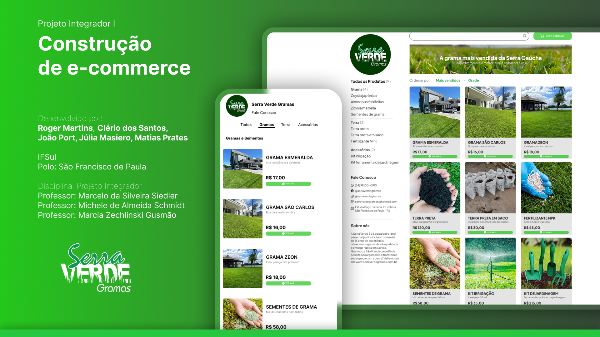

<h1 align="center">Serra Verde Gramas | E-commerce (Projeto Integrador I)</h1>

<p align="center">
  <a href="https://rogermorony.github.io/projeto-integrador-I---Serra-Verde/"><b>Visite o site</b></a>
</p>

<p align="center">
  
  
</p>

<p align="center">
  
</p>

---

Este projeto faz parte da disciplina de <b>Projeto Integrador I</b>.  
O objetivo é desenvolver o <b>front-end estático de um e-commerce</b> fictício da empresa <b>Serra Verde Gramas</b>, aplicando HTML e CSS.

---

## 📌 Páginas Essenciais

- **Página Inicial (`index.html`)**  
  - Barra de busca  
  - Botão “Ver o Carrinho”  
  - Banner principal (hero section)  
  - Vitrine de produtos em destaque (cards com imagem, título, descrição, preço e botão “Ver mais”)  
  - Sidebar com categorias, filtros, contatos e informações da empresa  

- **Página de Produtos (lista de categorias)**  
  - Sidebar com categorias: **Grama**, **Terra**, **Acessórios**  
  - Cada categoria exibe seus produtos

- **Página de Detalhes do Produto**  
  - Imagem grande  
  - Nome, descrição, preço e botão **“Adicionar ao Carrinho”**  
  - Ações secundárias: **copiar link** e **compartilhar**  
  - Seção de **produtos relacionados**

- **Página de Carrinho (`carrinho.html`)**  
  - Lista de produtos (quantidade, preço e subtotal)  
  - Campos de endereço e pagamento  
  - Resumo do pedido com botão **“Confirmar Pagamento”**

---

## 🎨 Tecnologias Utilizadas
- **HTML5**  
- **CSS3**  
- **Google Fonts** (Plus Jakarta Sans / Inter)  
- **Ionicons** (ícones)

---

## 📂 Estrutura de Arquivos

```
PROJETO INTEGRADOR I - SERRA VERDE/
├─ index.html
├─ pages/
│  ├─ carrinho.html
│  ├─ faleconosco.html
│  └─ detalhes/
│     ├─ esmeralda.html
│     ├─ sao-carlos.html
│     ├─ zeon.html
│     ├─ terra.html
│     ├─ terra-em-saco.html
│     ├─ fertilizante.html
│     ├─ irrigacao.html
│     ├─ sementes.html
│     └─ ferramentas.html
├─ styles/
│  ├─ main.css
│  ├─ pages/
│  │  ├─ carrinho.css
│  │  ├─ faleconosco.css
│  │  └─ detalhes/
│  │     ├─ esmeralda.css
│  │     ├─ sao-carlos.css
│  │     ├─ zeon.css
│  │     ├─ terra.css
│  │     ├─ terra-em-saco.css
│  │     ├─ fertilizante.css
│  │     ├─ irrigacao.css
│  │     ├─ sementes.css
│  │     └─ ferramentas.css
├─ assets/
│  ├─ Cover.png
│  ├─ logo.svg / logo.png
│  ├─ imgs/
│  └─ icons/
└─ README.md

```

---

## 🧭 Navegação & Padrões Visuais

- Layout limpo, com **cards** de produto, **sidebar** à esquerda e **barra superior** com busca e carrinho.  
- Tipografia **Plus Jakarta Sans / Inter** para títulos e textos.  
- Ícones via **Ionicons**.  
- Grid responsivo para listar produtos e manter a capa alinhada.

---

## 👥 Equipe

**Desenvolvido por:**  
Roger Martins, Clério dos Santos, João Port, Júlia Masiero e Matias Prates

**IFSul — Polo:** São Francisco de Paula

**Professores:**  
- Marcia Zechlinski Gusmão
- Marcelo da Silveira Siedler  
- Michele de Almeida Schmidt  


---

## 🤝 Contribuição

Sinta-se à vontade para abrir **issues** e **pull requests** com melhorias de layout e acessibilidade, correções ou novos componentes reutilizáveis (cards, banners, etc).

---

## 📝 Licença

Este projeto está sob a licença **MIT**.
